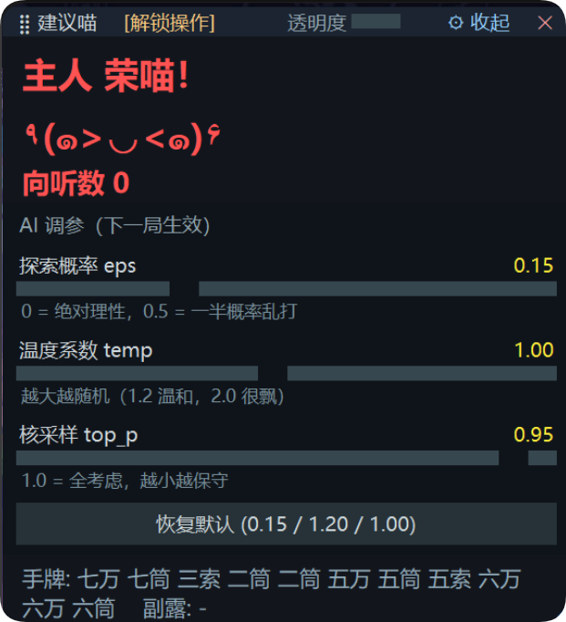

# 雀魂实时 AI 建议（Mortal 猫娘版）
## ⚠️ 重要声明与使用限制喵！

> **本项目仅供编程学习、AI 算法研究以及技术交流使用喵~**
> 
> **🚫 天梯/段位对战是绝对禁止的喵！**
> 
> 1. **仅限练习场景喵~**：本项目仅允许在 **自建房（友人房）** 中，与 **好友** 或 **电脑（PC）** 进行对战练习喵。
> 2. **保护游戏环境**：天梯（段位场）是玩家公平竞技的场所喵。使用任何第三方辅助工具参与天梯对战，不仅严重破坏其他玩家的游戏体验，也直接违反了游戏的用户协议喵！。
> 3. **封号风险与免责（严肃喵）**：使用本脚本存在账号被封禁的风险。任何因违规使用（尤其是用于天梯对战）导致的账号封禁、处罚或其他损失，**作者不承担任何责任，后果由使用者自行承担**。
> 4. **严禁商业牟利**：严禁将本项目（包括但不限于源码、编译产物、模型）打包出售或用于任何形式的商业牟利喵！绝对不行的喵！(ᗒᗣᗕ)՞

---

## ✨ 项目简介喵
读取雀魂网页版的下行对局数据，解析成 mjai 事件后交给 [Mortal](https://github.com/Equim-chan/Mortal) 推理，
把每一步的出牌建议显示在置顶悬浮窗里喵~ 出牌还得你自己动手喵！

## 📦 需要准备的东西喵~

- Windows 10/11、Python 3.12
- [Mortal](https://github.com/Equim-chan/Mortal) 与 [mahjong_soul_api](https://github.com/MahjongRepository/mahjong_soul_api)
- Rust 与 C++ 工具链，用于编译 `libriichi`，见 [`docs/02-build-libriichi.md`](docs/02-build-libriichi.md)
- Playwright + Chromium

喵喵喵喵喵~꜀(^. .^꜀  )꜆੭

## 🚀 开始配置的步骤喵！

1. 编译 `libriichi`
2. 安装依赖：`python -m pip install -r requirements.txt`、`python -m playwright install chromium`
3. 复制 `config.example.py` 为 `config.py`，按注释填写（协议解析所需的 XOR 混淆密钥需自行准备喵！）
4. 入口：`python main.py`；隐藏控制台可用 `pythonw run_headless.py`，日志写入 `run_log.txt`

喵喵喵~

## 📂 目录说明喵

| 文件 | 作用 |
|---|---|
| `main.py` | 入口：启动浏览器、监听 WebSocket、调度解析与推理 |
| `liqi_parser.py` | Liqi 协议解析，翻译成 mjai 事件 |
| `tiles.py` / `riichi.py` | 牌码映射与听牌判定 |
| `mortal_advisor.py` | Mortal 引擎适配 |
| `overlay.py` | tkinter 置顶悬浮窗 |
| `run_headless.py` | 无控制台启动的日志重定向 |

## ⚙️ 调参说明喵

`ai_tuning.json` 中的 `eps`、`temp`、`top_p` 分别控制不取最优动作的概率、采样温度与核采样阈值喵~，
从 `ai_tuning.example.json` 复制一份即可；悬浮窗右上角 ⚙ 面板也可直接调整，下一局生效喵！

## 许可与来源

- 本项目以 **AGPL-3.0** 发布，见 [`LICENSE`](LICENSE)。
- 上游项目见 [`NOTICE.md`](NOTICE.md)。
